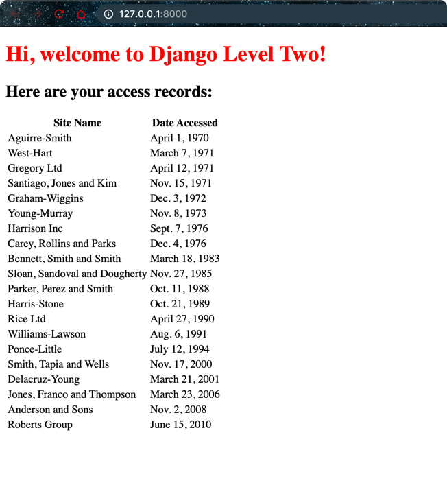
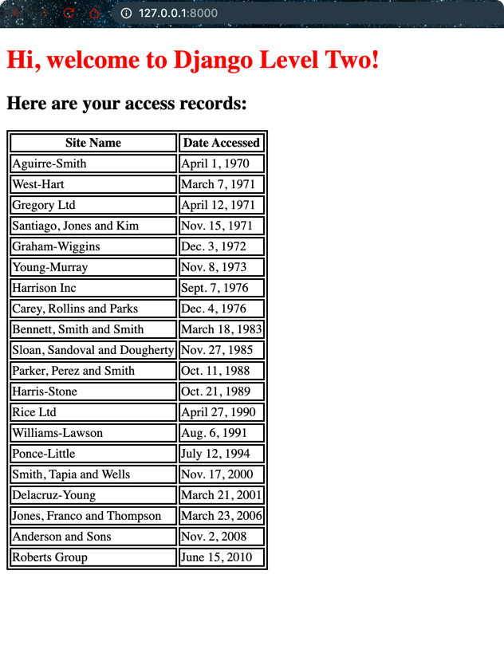

### Models-Templates-Views Paradigm

- Change the models.py with following
```python
from django.db import models


# SuperUserInformation
# User: Jose
# Email: training@pieriandata.com
# Password: testpassword

# CREATE SOME TEST DATA WITH SOME SHELL COMMANDS:

# python manage.py shell

# from first_app.models import Topic
# print(Topic.objects.all())
# t = Topic(top_name="Social Network")
# t.save()
# print(Topic.objects.all())
# quit()

class Topic(models.Model):
    top_name = models.CharField(max_length=264, unique=True)

    def __str__(self):
        return self.top_name


class Webpage(models.Model):
    topic = models.ForeignKey(
        Topic,
        on_delete=models.CASCADE,
    )
    name = models.CharField(max_length=264, unique=True)
    url = models.URLField(unique=True)

    def __str__(self):
        return self.name


class AccessRecord(models.Model):
    name = models.ForeignKey(
        Webpage,
        on_delete=models.CASCADE,
    )
    date = models.DateField()

    def __str__(self):
        return str(self.date)

```

- Change the index.html with the following
```html
<!DOCTYPE html>

<html>
  <head>
    <meta charset="utf-8">
    <title>Django Level Two</title>
    <link rel="stylesheet" href=""/>
  </head>
  <body>
    <h1>Hi, welcome to Django Level Two!</h1>
    <h2>Here are your access records:</h2>
    <div class="djangtwo">
      
          <table>
            <thead>
              <th>Site Name</th>
              <th>Date Accessed</th>
            </thead>

            
              <tr>
                <td>{{ acc.name }}</td>
                <td>{{ acc.date }}</td>
              </tr>
            
        </table>

      
        <p>No Access Records. Table Not Created.</p>
      
    </div>


  </body>
</html>
```

- And views.py with the following
```python
from django.shortcuts import render
from django.http import HttpResponse
from first_app.models import Topic,Webpage,AccessRecord
# Create your views here.

# Our original index view function
# Corresponds to original_index.html (rename it to index.html to use it!)

# def index(request):
#     my_dict = {'insert_me':"Now I am coming from first_app/index.html!"}
#     # Make sure this is pointing to the correct index
#     return render(request,'first_app/index.html',context=my_dict)


def index(request):
    webpages_list = AccessRecord.objects.order_by('date')
    date_dict = {"access_records":webpages_list}
    return render(request,'first_app/index.html',date_dict)

```


- Run the server again and check



- Also edit the mystyle.css file with the following
```css
h1{
  color: red;
}

table, th, td {
  border: 2px solid black;
}
```

- Again restart the server and check

